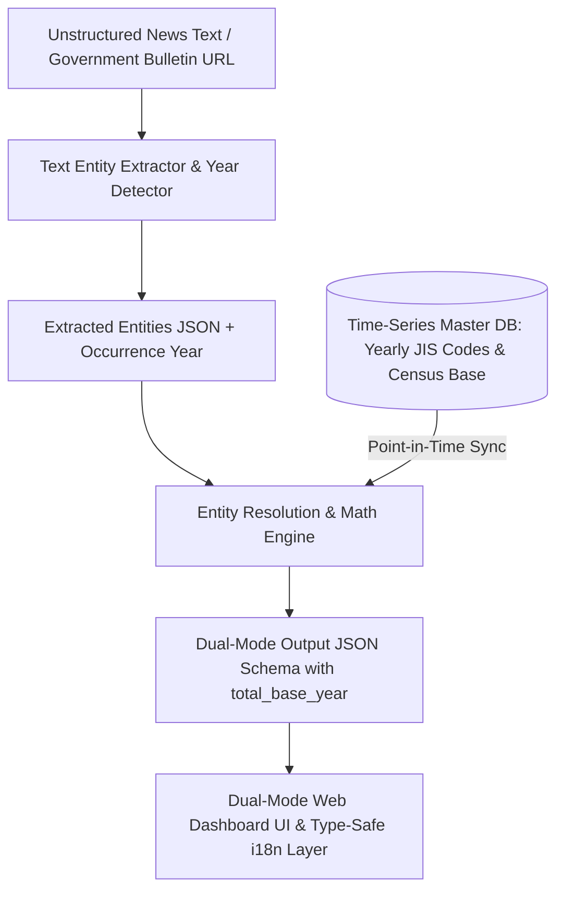

# Disaster-Density-Engine

[](LICENSE)
[](https://nodejs.org/)
[](https://www.python.org/)
[](https://www.typescriptlang.org/)

> 🇯🇵 **[日本語版 README はこちら (README_ja.md)](./README_ja.md)**

> **Open Data Engine dynamically resolving reported absolute disaster counts to municipal pre-disaster census baselines (denominators) for immediate relative impact density (%) calculation and dual-mode visualization.**

---

## 📌 Background & Motivation

During natural disaster emergency responses, initial news coverage and government press announcements predominantly highlight **absolute damage figures** (e.g., *"Kumamoto City: ~4,500 destroyed homes"*, *"Mashiki Town: ~3,000 destroyed homes"*, *"Nishihara Village: 513 destroyed homes"*).

However, because large metropolitan areas possess extensive baseline populations and building stocks, their absolute counts naturally appear larger. Conversely, in **rural or smaller municipalities, an absolute count of 500 destroyed homes might represent over 20% of the entire municipality's household stock—an extreme, catastrophic disaster impact ratio** that is frequently masked by raw absolute numbers.

`Disaster-Density-Engine` parses unstructured disaster news reports, performs entity resolution against Japanese Industrial Standards (JIS) 5-digit municipal codes, dynamically joins pre-disaster census baseline denominators (households, population, total building stock), and calculates the **true Disaster Impact Density (%)**.

---

## ⚡ Key Features

1. **⏱️ Synchronized Point-in-Time Census Denominator Resolution**
   - Resolves denominator discrepancies between past disaster events (e.g., 2016 Kumamoto Earthquake) and ongoing hazards (e.g., 2026 Reiwa 8 Kumamoto Earthquake).
   - Automatically detects disaster occurrence year and joins the census baseline immediately preceding the disaster (`total_base_year`).
2. **📢 2026 Reiwa 8 Kumamoto Earthquake Support & Dynamic $N_{\max}$ Bulletin Resolution**
   - Built-in support for ongoing 2026 Reiwa 8 Kumamoto Earthquake emergency bulletins (Bulletin #14).
   - Dynamically determines the maximum report number $N_{\max}$ within a disaster series, tagging `is_latest: true` and boosting it to top-priority search resolution.
   - Future undefined bulletin queries (e.g., "Bulletin #15", "Bulletin #16") are automatically synthesized and resolved as latest.
3. **🌐 Type-Safe i18n Architecture & DRR / GIS Domain Glossary**
   - Strict TypeScript dictionary architecture enforcing `typeof ja` key parity across languages (`ja.ts` / `en.ts`).
   - Standardized Disaster Risk Reduction (DRR) and GIS domain terms (*Disaster Impact Density*, *Evacuation Order*, *Inundation Depth*, *Building Collapse Rate*, *Potentially Isolated Areas*).
   - Responsive Zero Layout Shift design ensuring flawless UI rendering when toggling languages.
4. **🏛️ Real-Time Government Bulletin Search & Live Scraping**
   - Live query searching against Ministry of Internal Affairs and Communications (MIC) & Fire and Disaster Management Agency (FDMA) feeds.
   - Instant web scraping from arbitrary government news URLs to parse impact density ratios.
5. **Text Entity Extractor & JIS Code Entity Resolution**
   - Context-aware Japanese text entity extraction with digit normalization.
   - Automatic normalization of ambiguous municipal names (e.g., "Mashiki", "Mashiki-machi", "Kamimashiki District Mashiki Town") to 5-digit JIS codes.
6. **Dual-Mode Visualizer Dashboard**
   - **Absolute Magnitude Mode**: Sorted by traditional raw damage counts (large cities first).
   - **Impact Density Mode (%)**: Highlights severely devastated small/rural municipalities at the top of the queue.

---

## 🏗️ System Architecture



---

## 📋 Output JSON Schema Specification

Standardized output JSON payload generated by the engine (includes `total_base_year` and `is_latest` flags):

```json
{
  "timestamp": "2026-07-31T08:00:00Z",
  "disaster_name": "2026 Reiwa 8 Kumamoto Earthquake (FDMA Emergency Bulletin #14 - Latest)",
  "is_latest": true,
  "data": [
    {
      "jis_code": "43201",
      "prefecture": "Kumamoto Prefecture",
      "city_name": "Kumamoto City",
      "metrics": {
        "damage_type": "collapsed_houses",
        "absolute_count": 5500,
        "total_base": 395000,
        "total_base_year": 2026,
        "relative_rate_percent": 1.39,
        "severity_rank": "MODERATE"
      }
    },
    {
      "jis_code": "43441",
      "prefecture": "Kumamoto Prefecture",
      "city_name": "Mashiki Town",
      "metrics": {
        "damage_type": "collapsed_houses",
        "absolute_count": 3600,
        "total_base": 16500,
        "total_base_year": 2026,
        "relative_rate_percent": 21.82,
        "severity_rank": "CRITICAL"
      }
    },
    {
      "jis_code": "43443",
      "prefecture": "Kumamoto Prefecture",
      "city_name": "Nishihara Village",
      "metrics": {
        "damage_type": "collapsed_houses",
        "absolute_count": 650,
        "total_base": 3300,
        "total_base_year": 2026,
        "relative_rate_percent": 19.70,
        "severity_rank": "CRITICAL"
      }
    }
  ]
}
```

---

## 🚀 Quick Start

### Prerequisites
- **Node.js** (v18.x or higher)
- **Python** (3.8 or higher) *when using Python pipeline*

### 1. Clone Repository & Install Dependencies
```bash
git clone https://github.com/Hideyoshi-Fukuoka/Disaster-Density-Engine.git
cd Disaster-Density-Engine
npm install
```

### 2. Launch Backend API Server & Dashboard (Node.js)
```bash
npm start
# or node backend/server.js
```
Open `http://localhost:3000` (or Vercel URL `https://disaster-density-engine.vercel.app/`) in your browser.

### 3. Run Verification Tests
```bash
# Government Search & Dynamic N_max Resolution Test
node tests/test_gov_search.js

# Core Engine & Math Density Test
node tests/test_engine.js

# Type-Safe i18n & Domain Glossary Test
npx tsx tests/test_i18n.js

# TypeScript Strict Compiler Check
npx -p typescript tsc --noEmit
```

---

## 📁 Directory Structure

```text
Disaster-Density-Engine/
├── backend/
│   ├── extractor.js        # Unstructured text entity extractor
│   ├── gov_fetcher.js      # Live government bulletin search & N_max resolution
│   ├── master_db.js        # Time-series (Point-in-Time) JIS census master DB
│   ├── math_engine.js      # Impact density math engine & severity classification
│   ├── resolver.js         # Municipal entity resolution & JIS code normalizer
│   └── server.js           # REST API server
├── src/
│   ├── i18n/
│   │   ├── config.ts       # Locales configuration & Dictionary type
│   │   ├── get-dictionary.ts# Dictionary async/sync loader utility
│   │   └── dictionaries/
│   │       ├── ja.ts       # Japanese master dictionary (as const)
│   │       └── en.ts       # English dictionary (strictly typed via ja)
│   ├── types/
│   │   └── gis-domain.ts   # DRR & GIS domain model type definitions
│   └── components/         # i18n-enabled React UI components
├── public/                 # Web Dashboard UI (HTML/CSS/JS)
├── seeds/                  # Municipal master census seed data (CSV/JSON)
├── tests/                  # Pipeline & i18n unit tests
├── tsconfig.json
├── package.json
├── README.md               # English README (Main)
└── README_ja.md            # Japanese README
```

---

## 📄 License

This project is licensed under the **[MIT License](LICENSE)**. Free for commercial and non-commercial use, modification, and redistribution.
