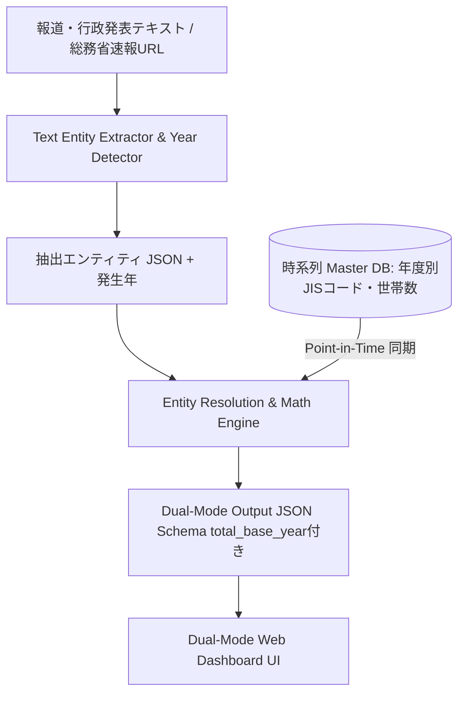

# Disaster-Density-Engine (被害密度算出・二重軸可視化データエンジン)

[](LICENSE)
[](https://nodejs.org/)
[](https://www.python.org/)

> **「絶対数（規模）」の報道から災害発生直前の自治体「全体数（分母）」を動的に時系列引き当て、「被害密度（相対数: %）」を即座に算出・二重軸可視化するオープンデータエンジン**

---

## 📌 背景と課題意識

災害発生時、報道や行政発表では **「熊本市で全壊約4,500棟」「益城町で全壊約3,000棟」「西原村で全壊513棟」** といった被害の「絶対数」が先行して伝えられます。

しかし、大都市は人口・世帯数の規模が大きいため絶対数が大きく見える一方、人口や世帯数が少ない**過疎・中小自治体では「被害絶対数は500棟でも、全世帯の20%以上が全壊」という致命的被害が発生しているケース**が多くあります。

`Disaster-Density-Engine` は、非構造化テキストから被害数値と自治体名を抽出・名寄せし、災害発生日時直前の総務省JISコードおよび国勢調査世帯数マスター（分母）と動的に結合することで、**「真の被害密度（重症度 %）」** を算出・可視化します。

---

## ⚡ 主な機能・特徴

1. **⏱️ 災害発生日時に同期した時系列マスター引き当て (Point-in-Time Resolution)**
   - 過去の災害（例: 2016年熊本地震）と現在進行中の災害（例: 令和8年熊本地震）で分母が異なる問題に対応。
   - 災害発生日時（発生年）を自動判定し、**「その災害発生直前の最新自治体統計（世帯数・人口・建物数）」**を時系列で自動参照・結合します（参照年次 `total_base_year` を明記）。
2. **📢 令和8年熊本地震 (進行中ハザード) & 動的「第N報」自動適応機能**
   - 進行中の「令和8年熊本地震」最新発表データを標準サポート。
   - 今後発表される「第14報」「第15報」等の新しい速報に対しても、クエリから報数を動的に解読・補完生成し、未定義データでも即座に検索・選択・解析が可能です。
3. **🏛️ 総務省・消防庁 報道発表ライブ検索 & URL即時フェッチ**
   - 総務省緊急情報ポータルや消防庁非常災害対策本部の速報を柔軟にキーワード検索（助詞除去・表記揺れ・全半角吸収）。
   - 任意の報道WebページURLを直接指定して、本文から被害密度（%）を即時自動計算。
4. **Text Entity Extractor & Entity Resolution**
   - 桁区切り表記（例: 4,500棟）や文脈に対応した日本語災害テキスト抽出器。
   - 「益城」「熊本県益城町」「上益城郡益城町」などの行政区画表記揺れをJISコードへ自動正規化。
5. **Dual-Mode Visualizer (二重軸比較ダッシュボード)**
   - **被害規模モード（絶対数順）**: 伝統的な大都市被害規模のソート表示。
   - **被害密度モード（相対数%順）**: 致命的な被害密度の過疎・中小自治体が最上位に浮き出る重症度ハイライト可視化。

---

## 🏗️ システムアーキテクチャ



---

## 📋 Output JSON Schema 仕様

本エンジンが出力する標準 JSON フォーマットです（時系列参照年次 `total_base_year` を含みます）。

```json
{
  "timestamp": "2026-07-30T20:30:00Z",
  "disaster_name": "令和8年熊本地震 (消防庁被害速報第13報・最新)",
  "data": [
    {
      "jis_code": "43201",
      "prefecture": "熊本県",
      "city_name": "熊本市",
      "metrics": {
        "damage_type": "collapsed_houses",
        "absolute_count": 5400,
        "total_base": 395000,
        "total_base_year": 2026,
        "relative_rate_percent": 1.37,
        "severity_rank": "MODERATE"
      }
    },
    {
      "jis_code": "43441",
      "prefecture": "熊本県",
      "city_name": "益城町",
      "metrics": {
        "damage_type": "collapsed_houses",
        "absolute_count": 3500,
        "total_base": 16500,
        "total_base_year": 2026,
        "relative_rate_percent": 21.21,
        "severity_rank": "CRITICAL"
      }
    },
    {
      "jis_code": "43443",
      "prefecture": "熊本県",
      "city_name": "西原村",
      "metrics": {
        "damage_type": "collapsed_houses",
        "absolute_count": 630,
        "total_base": 3300,
        "total_base_year": 2026,
        "relative_rate_percent": 19.09,
        "severity_rank": "CRITICAL"
      }
    }
  ]
}
```

---

## 🚀 クイックスタート

### 開発環境要件
- **Node.js** (v18.x 以上)
- **Python** (3.8 以上) ※Python版パイプライン利用時

### 1. リポジトリのクローン & パッケージインストール
```bash
git clone https://github.com/Hideyoshi-Fukuoka/Disaster-Density-Engine.git
cd Disaster-Density-Engine
npm install
```

### 2. バックエンド API サーバー & ダッシュボードの起動 (Node.js)
```bash
npm start
# または node backend/server.js
```
起動後、ブラウザで `http://localhost:3000` （またはデプロイURL `https://disaster-density-engine.vercel.app/`）にアクセスしてください。

### 3. 検証テストの実行
```bash
# 検索・動的報数・時系列同期テスト
node tests/test_gov_search.js

# コアエンジン・被害密度算出テスト
node tests/test_engine.js

# Python 版パイプラインの実行
python pipeline.py
```

---

## 📁 フォルダ構成

```text
Disaster-Density-Engine/
├── backend/
│   ├── extractor.js        # 非構造化テキスト解析・抽出器
│   ├── gov_fetcher.js      # 総務省・消防庁報道発表動的フェッチャー
│   ├── master_db.js        # 時系列(Point-in-Time) JISコード・世帯数マスターDB
│   ├── math_engine.js      # 相対数(%)計算・100%上限ガード・重症度判定
│   ├── resolver.js         # 表記揺れ名寄せ (Entity Resolution)
│   └── server.js           # REST API サーバー
├── public/                 # ダッシュボード UI (HTML/CSS/JS)
│   ├── index.html
│   ├── style.css
│   └── app.js
├── seeds/                  # 自治体マスターシードデータ (CSV/JSON)
│   ├── municipalities_master.csv
│   └── municipalities_master.json
├── tests/                  # パイプライン単体検証テスト
│   ├── test_engine.js
│   └── test_gov_search.js
├── master_db.py            # Python版 Master DB & 名寄せモジュール
├── pipeline.py             # Python版 コアパイプライン
├── package.json
└── README.md
```

---

## 📄 ライセンス (License)

本プロジェクトは **[MIT License](LICENSE)** の下で公開されています。商用・非商用を問わず自由にご利用・改変・再配布いただけます。
