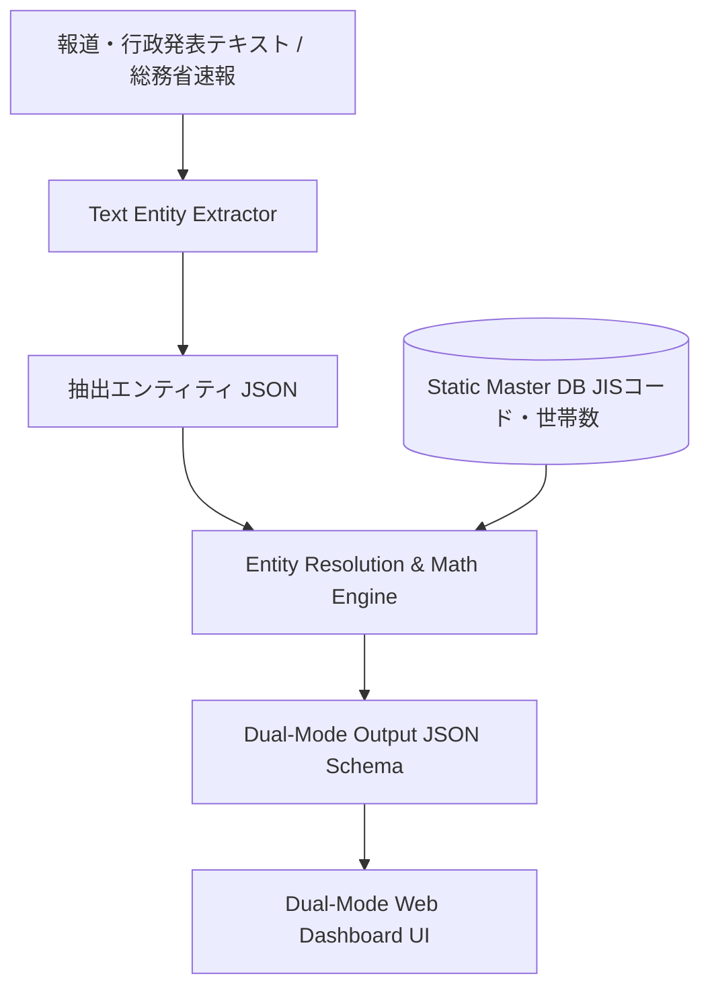

# Disaster-Density-Engine (被害密度算出・二重軸可視化データエンジン)

[](LICENSE)
[](https://nodejs.org/)
[](https://www.python.org/)

> **「絶対数（規模）」の報道から自治体の「全体数（分母）」を動的に引き当て、「被害密度（相対数: %）」を即座に算出・二重軸可視化するオープンデータエンジン**

---

## 📌 背景と課題意識

災害発生時、報道や行政発表では **「熊本市で全壊約4,500棟」「益城町で全壊約3,000棟」「西原村で全壊513棟」** といった被害の「絶対数」が先行して伝えられます。

しかし、大都市は人口・世帯数の規模が大きいため絶対数が大きく見える一方、人口や世帯数が少ない**過疎・中小自治体では「被害絶対数は500棟でも、全世帯の20%以上が全壊」という致命的被害が発生しているケース**が多くあります。

`Disaster-Density-Engine` は、非構造化テキストから被害数値と自治体名を抽出・名寄せし、総務省JISコードおよび国勢調査世帯数マスター（分母）と動的に結合することで、**「真の被害密度（重症度 %）」** を算出・可視化します。

---

## ⚡ 主な機能・特徴

1. **Static Master DB Module**
   - 総務省「全国地方公共団体コード（JISコード）」に紐づく世帯数・総人口・住家総数の参照用データベース。
   - 全国47都道府県の主要自治体および災害警戒地域のシードデータを完備。
2. **Text Entity Extractor**
   - 桁区切り表記（例: 4,500棟）や文脈キャリーオーバーに対応した日本語災害テキスト抽出器。
   - `{自治体名, 被害種別, 被害絶対数, タイムスタンプ}` を高精度に構造化。
3. **Entity Resolution & Math Engine**
   - 「益城」「熊本県益城町」「上益城郡益城町」などの複雑な行政区画表記揺れをJISコードへ正規化（名寄せ結合）。
   - 被害率 $\text{damage\_rate (\%)} = \left( \frac{\text{damage\_count}}{\text{total\_households}} \right) \times 100$ および重症度ランク (`CRITICAL`, `SEVERE`, `MODERATE`, `LOW`) を算出。
4. **🏛️ 総務省・消防庁 報道発表自動フェッチ**
   - 総務省消防庁・内閣府等の公式災害速報（熊本地震、能登半島地震、令和2年7月豪雨速報など）をワンタップで自動取得し解析。
5. **Dual-Mode Visualizer (二重軸比較ダッシュボード)**
   - **被害規模モード（絶対数順）**: 伝統的な大都市被害規模のソート表示。
   - **被害密度モード（相対数%順）**: 致命的な被害密度の過疎・中小自治体が最上位に浮き出る重症度ハイライト可視化。

---

## 🏗️ システムアーキテクチャ



---

## 📋 Output JSON Schema 仕様

本エンジンが出力する標準 JSON フォーマットです。

```json
{
  "timestamp": "2026-07-30T10:54:23Z",
  "disaster_name": "熊本地震（想定データ）",
  "data": [
    {
      "jis_code": "43201",
      "prefecture": "熊本県",
      "city_name": "熊本市",
      "metrics": {
        "damage_type": "collapsed_houses",
        "absolute_count": 4500,
        "total_base": 320000,
        "relative_rate_percent": 1.41,
        "severity_rank": "MODERATE"
      }
    },
    {
      "jis_code": "43441",
      "prefecture": "熊本県",
      "city_name": "益城町",
      "metrics": {
        "damage_type": "collapsed_houses",
        "absolute_count": 3000,
        "total_base": 13500,
        "relative_rate_percent": 22.22,
        "severity_rank": "CRITICAL"
      }
    },
    {
      "jis_code": "43443",
      "prefecture": "熊本県",
      "city_name": "西原村",
      "metrics": {
        "damage_type": "collapsed_houses",
        "absolute_count": 513,
        "total_base": 2600,
        "relative_rate_percent": 19.73,
        "severity_rank": "CRITICAL"
      }
    }
  ]
}
```

---

## 🚀 クイックスタート

### 開発環境要件
- **Node.js** (v18.x 以上)
- **Python** (3.8 以上) ※Python版パイプライン利用時

### 1. リポジトリのクローン & パッケージインストール
```bash
git clone https://github.com/Hideyoshi-Fukuoka/Disaster-Density-Engine.git
cd Disaster-Density-Engine
npm install
```

### 2. バックエンド API サーバー & ダッシュボードの起動 (Node.js)
```bash
npm start
# または node backend/server.js
```
起動後、ブラウザで `http://localhost:3000` にアクセスしてください。

### 3. Python 版パイプラインの単体実行
```bash
python pipeline.py
```

---

## 📁 フォルダ構成

```text
Disaster-Density-Engine/
├── backend/
│   ├── extractor.js        # 非構造化テキスト解析・抽出器
│   ├── gov_fetcher.js      # 総務省・消防庁報道発表フェッチャー
│   ├── master_db.js        # JISコード・世帯数マスターDB
│   ├── math_engine.js      # 相対数(%)計算・重症度ランク判定
│   ├── resolver.js         # 表記揺れ名寄せ (Entity Resolution)
│   └── server.js           # REST API サーバー
├── public/                 # ダッシュボード UI (HTML/CSS/JS)
│   ├── index.html
│   ├── style.css
│   └── app.js
├── seeds/                  # 自治体マスターシードデータ (CSV/JSON)
│   ├── municipalities_master.csv
│   └── municipalities_master.json
├── tests/                  # パイプライン単体検証テスト
│   └── test_engine.js
├── master_db.py            # Python版 Master DB & 名寄せモジュール
├── pipeline.py             # Python版 コアパイプライン
├── package.json
└── README.md
```

---

## 📄 ライセンス (License)

本プロジェクトは **[MIT License](LICENSE)** の下で公開されています。商用・非商用を問わず自由にご利用・改変・再配布いただけます。
